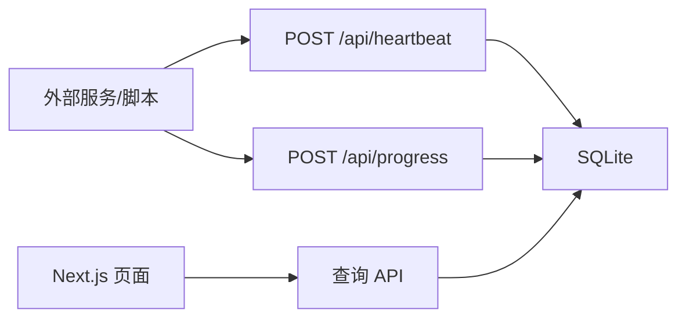

# info-web 设计文档

## 目标

实现 PRD 中的个人服务状态面板 V1：不做复杂监控平台，只提供服务状态、心跳、任务进度、异常提示和最近事件。

## 非目标

- 不接入 Prometheus、Grafana、Kubernetes 或 Docker 深度监控。
- 不做多用户权限、多租户、复杂告警或全文日志搜索。
- 不做可拖拽仪表盘和复杂图表。

## 架构

应用采用 Next.js 单体结构：

- `app/api/*`：API 路由，负责服务 CRUD、心跳上报、进度上报和总览查询。
- `lib/db.ts`：SQLite 表初始化、数据读写、状态刷新。
- `lib/status.ts`：状态判断规则和进度百分比计算。
- `app/dashboard`：总览页，每 30 秒自动刷新。
- `app/services/[serviceKey]`：详情页。
- `app/settings`：简单配置页。

## 数据模型

SQLite 中维护三张表：

- `services`：服务基础信息、当前状态、最近心跳、最近进度和最近错误。
- `service_progress`：每次进度上报记录。
- `service_events`：最近事件来源，事件类型包括 `heartbeat`、`progress`、`error`。

## 状态规则

状态在查询和上报后刷新：

- `healthy`：5 分钟内心跳正常，或最近任务状态为 `success`。
- `running`：任务状态为 `running` 且 10 分钟内有进度更新。
- `error`：心跳/进度主动报错，心跳超过 5 分钟，或运行中任务超过 10 分钟无进度。
- `unknown`：刚创建且没有任何上报数据。

## 技术选型

- Next.js + React + TypeScript：用一个应用同时承载页面和 API，适合个人 V1。
- SQLite：零外部服务依赖，默认写入本地 `data/info-web.sqlite`。
- Node `node:sqlite`：减少原生 npm 包依赖，但当前 Node 会输出 experimental warning。
- 原生 CSS：界面规模小，避免引入 Tailwind 配置和额外构建复杂度。

## 已知限制

- 暂无认证，默认只适合可信网络或本机使用。
- 没有编辑服务的 UI，API 已支持 `PUT /api/services/:service_key`。
- `node:sqlite` 在当前 Node 版本仍标记为 experimental。
- 没有后台定时任务，状态在查询和上报时刷新，足够满足 V1 页面展示。

## 安全考量

- API 对必填字段、状态枚举、服务类型和数值字段做了基础校验。
- SQL 使用 prepared statements，避免拼接用户输入。
- 生产部署时应放在内网、反向代理认证后，或补充 token 校验。
