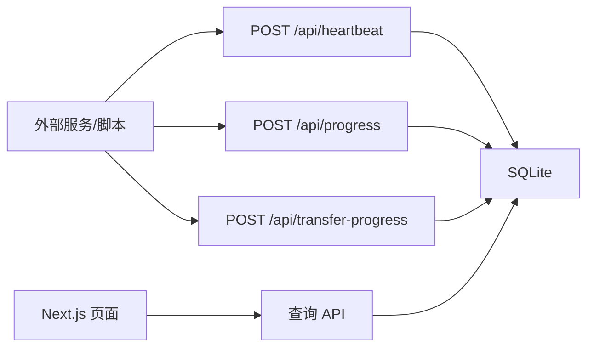

# info-web 设计文档

## 目标

实现个人服务状态面板，并提供由上报数据驱动的通用传输任务展示：任意项目可以声明动态分类，每个分类独立维护下载和上传进度，不需要项目专属前端页面。

## 非目标

- 不接入 Prometheus、Grafana、Kubernetes 或 Docker 深度监控。
- 不做多用户权限、多租户、复杂告警或全文日志搜索。
- 不做可拖拽仪表盘和复杂图表。

## 架构

```mermaid
flowchart LR
  Service["外部服务/脚本"] --> Heartbeat["POST /api/heartbeat"]
  Service --> Progress["POST /api/progress"]
  Service --> Transfer["POST /api/transfer-progress"]
  UI["Next.js 页面"] --> Query["查询 API"]
  Heartbeat --> DB["SQLite"]
  Progress --> DB
  Transfer --> DB
  Query --> DB
```

应用采用 Go API + Next.js 前端结构：

- `server/main.go`：REST API、Bearer 认证、SQLite 数据读写、状态刷新和受控运维动作。
- `web/app/*`：Next.js 页面；根布局中的 `AppProviders` 统一管理 SWR 自动刷新。
- `/dashboard`：总览，只返回有限条最近任务和告警，统计值由数据库全量聚合。
- `/services/[key]`：通用服务详情。
- `/sync`：服务端筛选、搜索和分页的任务列表。
- `/sync/[task_id]`：所有任务的 canonical 详情页；检测到通用传输分类后自动渲染总下载、总上传和动态分类双向进度。
- `/api-docs`：接入中心，创建项目级上报凭证并生成可直接交给目标项目代码助手的完整提示词。

旧地址 `/migration/pikpak-115` 永久重定向到通用任务详情。PikPak 专属后端运维动作暂时保留兼容，但展示层不再依赖专属页面。

## 数据模型

SQLite 中主要维护以下数据：

- `services`：服务基础信息、当前状态、最近心跳、最近进度和最近错误。
- `sync_tasks`：同步与迁移任务的当前快照。
- `transfer_snapshots`：通用传输任务的协议版本、最新单调序列和观测时间。
- `transfer_categories`：任务动态分类，主键为 `task_id + category_key`。
- `transfer_channels`：分类下的下载或上传快照，主键为 `task_id + category_key + direction`。
- `transfer_samples`：分类方向的限量吞吐采样，用于通用详情趋势图。
- `ingest_integrations`：项目级接入凭证，只保存 token 摘要和可展示前缀。
- `events`：最近事件来源，事件类型包括 `heartbeat`、`progress`、`error`。
- `alerts`：触发、恢复与静默的告警记录。
- `settings`：接入 token、面板 token 和行为配置。

列表接口使用统一分页 envelope：`items`、`total`、`page`、`page_size`、`counts`。`counts` 始终基于完整筛选域计算，不按当前页截断。任务默认 `current` 视图包含全部非成功任务和最近 7 天完成的成功任务；告警徽标使用轻量 `/api/alerts/count`，避免定时拉取完整告警列表。

通用传输接口采用完整快照而不是字段 patch。服务端在单事务内替换任务分类与方向快照，并用 `sequence` 拒绝乱序或重复上报。方向百分比优先按字节计算，其次按项目数，最后才采用显式百分比；总下载和总上传分别加权汇总，禁止直接平均分类百分比。通用快照同时回填 `sync_tasks` 摘要，因此旧仪表盘、任务列表和告警逻辑无需分叉。

## 状态规则

状态在查询和上报后刷新：

- `healthy`：5 分钟内心跳正常，或最近任务状态为 `success`。
- `running`：任务状态为 `running` 且 10 分钟内有进度更新。
- `stale`：原本运行中的任务超过 10 分钟没有进度更新；状态持久化并产生去重告警，新进度上报可恢复真实状态。
- `error`：心跳或进度主动报告错误，或服务心跳超过 5 分钟。
- `unknown`：刚创建且没有任何上报数据。

`stale` 不等同于 `running` 或 `paused`。页面不会向失联/错误任务提供“恢复”按钮，因为通用状态接口不能真正启动外部 worker。

## 技术选型

- Go + chi：提供轻量 API、认证和 SQLite 数据访问。
- Next.js + React + TypeScript：承载面板页面和客户端交互。
- SQLite：零外部服务依赖。
- 原生 CSS：界面规模小，避免引入 Tailwind 配置和额外构建复杂度。

## 已知限制

- 没有编辑服务的 UI，API 已支持 `PUT /api/services/:service_key`。
- 没有后台定时任务，状态在查询和上报时刷新，足够满足 V1 页面展示。
- 暂停/恢复接口只修改面板中的任务状态，不能代替外部 worker 的控制协议。
- 通用传输协议只负责观测，不抽象各项目不同的暂停、重试、全量检查等控制命令。

## 安全考量

- API 对必填字段、状态枚举、服务类型和数值字段做了基础校验。
- SQL 使用 prepared statements，避免拼接用户输入。
- 面板查询和运维动作使用 panel Bearer token；上报接口使用独立 ingest Bearer token。
- 旧全局 ingest token 继续兼容。新项目使用随机项目 token，数据库只保存 SHA-256 摘要；认证后将请求限定到对应 `service_key`，跨服务写入返回 403。轮换会立即使旧 token 失效，吊销不影响其他项目。
- 通用传输请求限制最多 64 个分类，拒绝负计数、完成量超过总量、非法状态、非法百分比和非 RFC3339 时间；单调序列防止异步请求乱序覆盖。
- “全量查漏”只允许面板认证用户触发。二进制、环境文件和日志路径仅能由可信的服务启动环境配置，命令参数保持固定；HTTP 请求不能传入这些值，响应也不泄露路径。并发执行由互斥状态限制。

## 刷新模型

根布局的 `AppProviders` 为所有页面提供同一份 SWR 配置。自动刷新开关和 10/30/60/300 秒间隔保存在浏览器本地存储，顶栏与设置页操作同一状态；“立即刷新”通过全局 SWR mutate 重新校验现有查询，不整页重载。

## 变更记录

- 2026-08-30：新增通用多分类传输快照协议、下载/上传独立聚合与动态详情页；接入中心支持项目级 Token 和 AI 一键接入；移除专属展示页作为 canonical 路径，旧单进度接口保持兼容。
- 2026-08-30：迁移工作台提升为一级导航和 canonical 页面；任务/告警改为服务端分页与全局计数；新增 `stale` 状态；统一全局刷新和加载态；恢复受控“全量查漏”入口。
